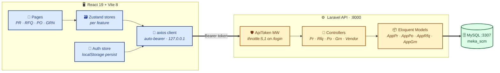
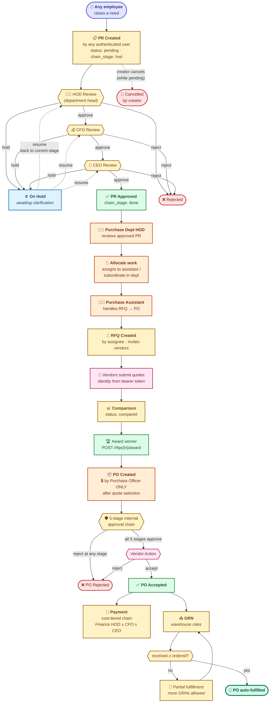
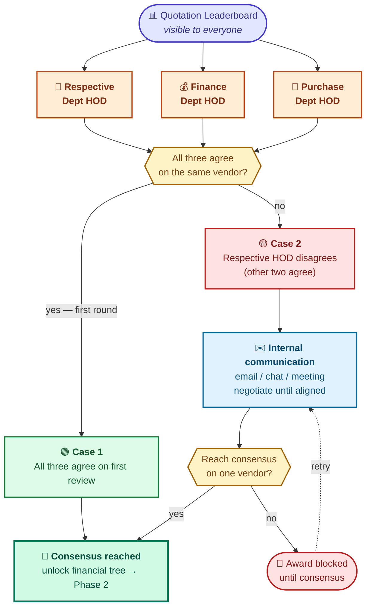
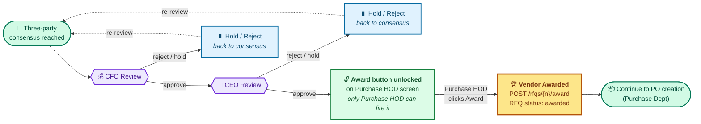
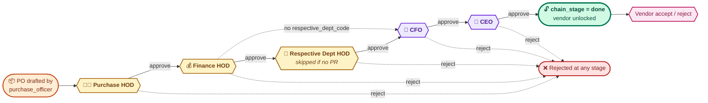
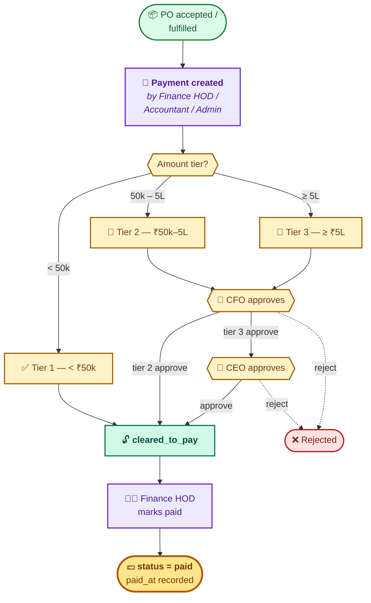
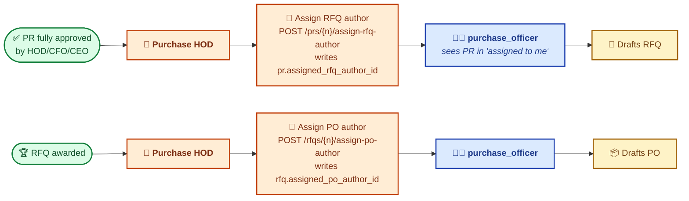
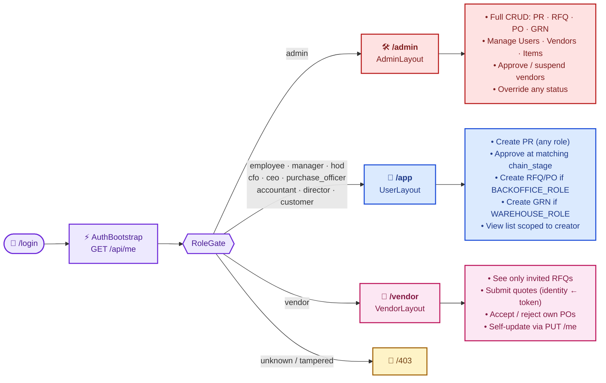
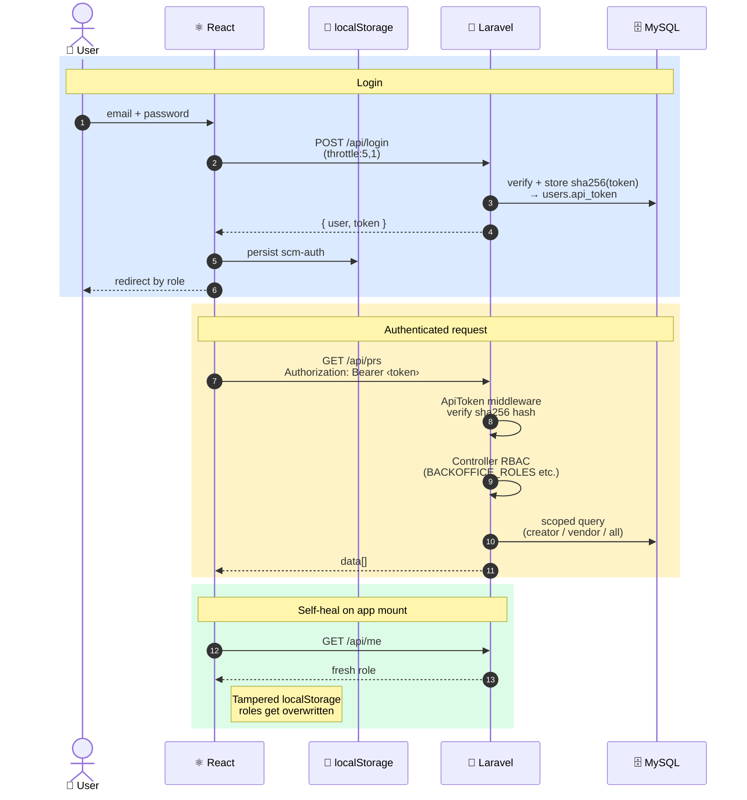
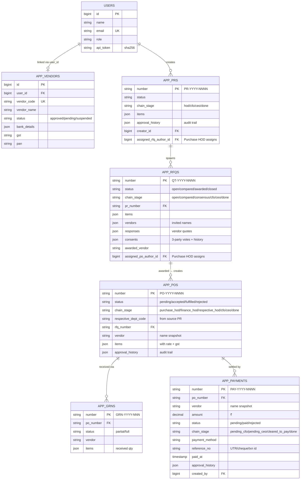

# SCM — Flow Diagrams

> Visual reference for how the Meka SCM system fits together.
> Diagrams use **Mermaid** — render in GitHub, Notion, or VS Code (with the Mermaid extension).

---

## Contents

1. [System Architecture](#1-system-architecture) — how the pieces talk to each other
2. [Procurement Pipeline](#2-procurement-pipeline) — PR → RFQ → PO → GRN end-to-end
3. [Award Approval Flow](#3-award-approval-flow) — three-party consensus + CFO/CEO chain
4. [PO Internal Approval Chain](#4-po-internal-approval-chain) — 5-stage gate before vendor can act
5. [Payment Approval Flow](#5-payment-approval-flow) — cost-tiered Finance / CFO / CEO chain
6. [Assignment System](#6-assignment-system) — Purchase HOD assigns RFQ / PO authoring
7. [Role-Based Access](#7-role-based-access) — who lands where, who can do what
8. [Auth & Request Lifecycle](#8-auth--request-lifecycle) — login, bearer flow, self-healing
9. [Data Model (ERD)](#9-data-model-erd) — core tables and relationships

---

## 1. System Architecture

---

## 2. Procurement Pipeline

End-to-end procure-to-receive flow. **Any employee** can raise a PR (request a need). After CEO approval, the **Purchase HOD** allocates the post-approval work (RFQ + PO authoring) to a subordinate. **PO creation is locked to `purchase_officer` only** — only that role finalises the formal order. Every status mutation is guarded by a **terminal-state check** (409 if record is already in a terminal state).

> **Status update — 2026-04-30**: every stage in this pipeline is implemented.
> - Three-party consensus + CFO/CEO award chain: §3.
> - Purchase HOD assignment of RFQ/PO authoring: §6.
> - PO 5-stage internal approval chain (`POChain`): §4.
> - Cost-tiered payment chain after acceptance: §5.

> ### 🔒 Access rules for this pipeline
>
> - **PR create** → **any authenticated user** (employees raise needs from across the org).
> - **RFQ create / delete** → **`admin` + `purchase_officer` only** (item 6). HODs — including Purchase HOD — have approve+read only and *assign* authoring to a subordinate officer.
> - **PO create** → **`admin` + `purchase_officer` only** (item 6). The Purchase HOD assigns the authoring task once an RFQ is awarded.
> - **Quotation comparison leaderboard** → visible to **everyone** (transparency by design).
> - **Award button** → gated by the three-party consensus + CFO/CEO chain detailed in [§3](#3-award-approval-flow). Only the **Purchase HOD** ultimately fires the award.
> - **PO accept / reject** (vendor) → blocked until the **5-stage internal approval chain** ([§4](#4-po-internal-approval-chain)) reaches `done`.
> - **Payment** → cost-tiered chain ([§5](#5-payment-approval-flow)) determines whether the Finance HOD can release funds directly or needs CFO / CFO+CEO sign-off first.

---

## 3. Award Approval Flow

> **Status — implemented**. `agree()` / `withdrawAgreement()` + `cfoApprove`/`ceoApprove` + `award()` chain via `app_rfqs.chain_stage` machine (`open → compared → consensus → cfo → ceo → done`). See `RfqController` for the live implementation.

The "Award" action on a quotation is **not** a single click — it requires a three-party internal consensus, then the same CFO → CEO approval tree used for PRs. Two scenarios cover whether the Respective Department HOD agrees on the first round.

### 🔒 Vendor rate lock during consensus (item 7)

Once **any** HOD records their `agree` vote (any of the `respective` / `finance` / `purchase` slots populated), `submitQuote` returns **409** for every invited vendor — quotes are frozen so vendors can't pitch lower mid-evaluation. The lock releases only when *every* voting HOD withdraws (lock is OR across slots; partial withdrawals don't release).

For vendors, the API responds with `rates_locked: true/false` only — the underlying `consents` payload is **scrubbed server-side** so the vendor doesn't see who voted or which vendor each evaluator picked.

### Phase 1 — Three-party consensus (departmental)

Three stakeholders must converge on **one vendor** before the financial-approval tree opens:

| Party | Role | Why they review |
| --- | --- | --- |
| 🏢 Respective Dept HOD | Originating department head | Confirms vendor meets the technical / operational need that drove the PR |
| 💰 Finance Dept HOD | Finance head | Validates pricing, payment terms, financial fit |
| 🛒 Purchase Dept HOD | Purchase head | Confirms vendor compliance, history, procurement-policy fit |

### Phase 2 — Financial approval tree + final award

Once the three departmental HODs agree on a vendor, the decision flows up the same approval tree used for PRs. The **Award button** only becomes functional on the Purchase HOD's screen after CEO approval.

> ### 🛡️ Award button visibility matrix
>
> | Stage | Award button visible? | Functional? | Who can fire? |
> | --- | --- | --- | --- |
> | Three-party consensus pending | ❌ Hidden | — | — |
> | Consensus reached, awaiting CFO | ❌ Hidden | — | — |
> | CFO approved, awaiting CEO | ❌ Hidden | — | — |
> | **CEO approved** | ✅ Visible | ✅ Yes | **Purchase HOD only** |
> | Awarded (terminal) | — | — | — |

---

## 4. PO Internal Approval Chain

> **Status — implemented (2026-04-30)**. `app_pos.chain_stage` + `PoController::updateStatus()`.

Once a `purchase_officer` drafts a PO, it doesn't go straight to the vendor — it passes through a **5-stage internal approval chain**. Each stage is gated to the matching role; admin overrides every stage. Reject at any stage closes the PO as `rejected`. Hold parks at the current stage until reviewed.

`respective_hod` is **skipped** automatically when `respective_dept_code` is null (ad-hoc PO with no PR ancestry).

> **Vendor visibility**: while the chain is live, vendor responses see only `released: false` (a boolean derived from `chain_stage='done'`). The fields `chain_stage`, `respective_dept_code`, `approval_history`, `last_comment` are stripped server-side via `PoController::scrubForVendor()`.

---

## 5. Payment Approval Flow

> **Status — implemented (2026-04-30)**. `app_payments.chain_stage` + `PaymentController::updateStatus()` / `markPaid()`. Items 10 + 11 of FLOW.

Once a PO is `accepted` (or `fulfilled`), Finance can issue a payment. The approval depth depends on the **amount**:

| Amount | Chain | Approvers required |
| --- | --- | --- |
| **< ₹50,000** | `cleared_to_pay` from create | Finance HOD releases directly |
| **₹50,000 – < ₹5,00,000** | `pending_cfo → cleared_to_pay` | CFO approve → Finance HOD releases |
| **≥ ₹5,00,000** | `pending_cfo → pending_ceo → cleared_to_pay` | CFO → CEO → Finance HOD releases |

> ### Visibility
>
> - **List** is open to every in-org role (transparency by design — same as the RFQ leaderboard). Vendors see only their own payments, scoped by `vendor_name`.
> - **Create** is restricted to Finance HOD / Accountant / Admin.
> - **Mark paid** is restricted to Finance HOD / Admin AND requires `chain_stage='cleared_to_pay'`.

---

## 6. Assignment System

> **Status — implemented (2026-04-30)**. New columns + endpoints, item 6.

Per the role policy, **HODs (incl. Purchase HOD) cannot author RFQs or POs directly** — they have approve+read access only. Authoring belongs to a `purchase_officer` subordinate. The Purchase HOD picks one and hands them the work.

> **Storage**: two nullable FK columns — `app_prs.assigned_rfq_author_id` and `app_rfqs.assigned_po_author_id` — both reference `users.id` with `nullOnDelete`.
>
> **Officer's queue**: `GET /prs?assigned_to_me=1` and `GET /rfqs?assigned_to_me=1` return only the documents handed to the calling user. `PrController::index()` also widens the default scope so an assigned officer sees PRs they didn't create.
>
> **Picker endpoint**: `GET /users/purchase-officers` returns the list of `purchase_officer` users. Restricted to PURCH HOD + admin.

---

## 7. Role-Based Access

Three audiences, three layouts, eleven roles. RBAC is enforced **defense-in-depth** — `<RoleGate>` on the route, axios bearer in transit, `ApiToken` middleware at the edge, controller `BACKOFFICE_ROLES` / `WAREHOUSE_ROLES` constants at the action.

---

## 8. Auth & Request Lifecycle

---

## 9. Data Model (ERD)

Core tables. All item lists, vendor invites, and quote responses are stored as **JSON columns** on the parent record — denormalised by design for snapshot integrity.

---

## Appendix · Auto-generated number formats

| Document | Pattern         | Example          |
| -------- | --------------- | ---------------- |
| PR       | `PR-YYYY-NNNN`  | `PR-2026-0042`   |
| RFQ      | `QT-YYYY-NNNN`  | `QT-2026-0017`   |
| PO       | `PO-YYYY-NNNN`  | `PO-2026-0009`   |
| GRN      | `GRN-YYYY-NNN`  | `GRN-2026-031`   |
| Payment  | `PAY-YYYY-NNNN` | `PAY-2026-5001`  |

## Appendix · Terminal states (mutation blocked, returns 409)

| Entity  | Terminal states                          |
| ------- | ---------------------------------------- |
| PR      | `approved` · `rejected` · `cancelled`  (`hold` is **non-terminal** — resumable) |
| RFQ     | `awarded` · `closed`                     |
| PO      | `fulfilled` · `rejected` (`accepted` ≠ terminal — GRN flow continues) |
| GRN     | _(no terminal — append-only)_            |
| Payment | `paid` · `rejected`                      |

## Appendix · Chain stages by entity

| Entity  | `chain_stage` values |
| ------- | -------------------- |
| PR      | `hod` → `cfo` → `ceo` → `done` |
| RFQ     | `open` → `compared` → `consensus` → `cfo` → `ceo` → `done` |
| PO      | `purchase_hod` → `finance_hod` → `respective_hod` → `cfo` → `ceo` → `done` (`respective_hod` skipped if no PR ancestry) |
| Payment | `cleared_to_pay` (Tier 1)  or `pending_cfo` → `cleared_to_pay` (Tier 2)  or `pending_cfo` → `pending_ceo` → `cleared_to_pay` (Tier 3)  then `done` after `markPaid` |
